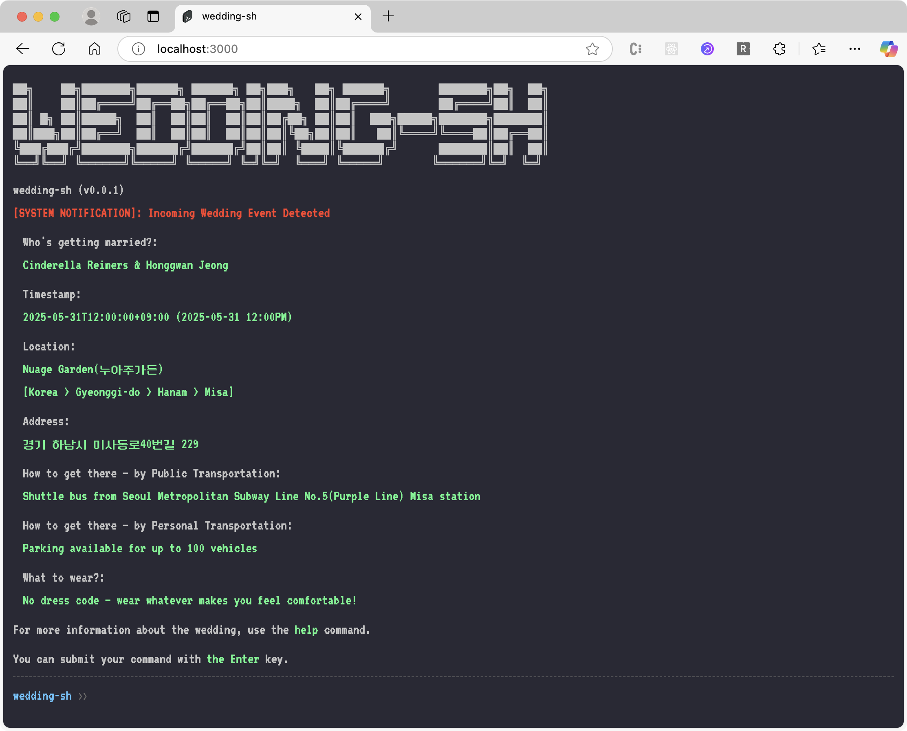

<div align="center">
  <a href="https://github.com/IwannabeRealnerD/khanne-sh">
    
  </a>

  <h2 align="center">khanne-sh</h2>

  <p align="center">
    A resume that isn't boring, and a way to get to know khanne better. <s>(not zsh)</s> khanne-sh(khanne shell)
    <br />
    <a href="https://iwannaberealnerd.github.io/khanne-sh/">Deployed Link</a>
    ·
    <a href="https://github.com/IwannabeRealnerD/khanne-sh/issues">Report Bug</a>
    ·
    <a href="https://github.com/IwannabeRealnerD/khanne-sh/issues">Request Feature</a>
  </p>
</div>

<div align="center">
  
  
  
</div>

<div align="center">
  
</div>
<p align="center">
This project is a web based terminal style resume developed with svelte kit.
</p>


## Deployed link
- [github pages](https://iwannaberealnerd.github.io/khanne-sh/)

## How to use
### Available Commands
```sh
	about # Get information about this project
	blog # Open new window for khanne's blog
	clear # Clear history
	contact # Get khanne's contact information
	github # Open new window for khanne's GitHub 
	help # Display available commands
	pwd # Show current URL
```
- Additional commands will be updated soon

## Getting started in your local environment
- To get started with this project, you need to clone the reapository and install the dependency.

### Environment Setup
- nodejs - 20.10.0
- pnpm - 9.13.0
  ```sh
  corepack prepare pnpm@9.13.0 --activate
  ```

### How to Deploy Dev Server
1. Clone repository
   ```sh
   git clone https://github.com/IwannabeRealnerD/khanne-sh.git
   ```
2. Install pnpm dependency
   ```sh
   pnpm install --frozen-lockfile
   ```
3. Start Dev Server
   ```sh
   pnpm dev
   ```

## Upcoming features

- [ ] Implement e2e test (playwright)
- [ ] Enhance README (e.g., how to add commands, etc.)

## Contact
khanne - iwannaberealnerd@gmail.com

## License

This project is licensed under the MIT License - see the [LICENSE](LICENSE) file for details.